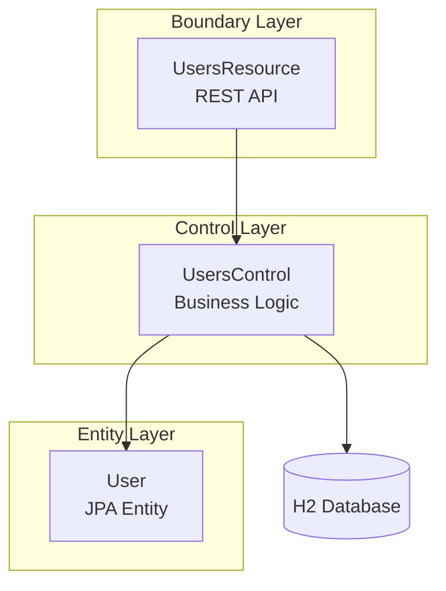

# Quarkus BCE - Users Business Component

A Quarkus-based microservice implementing the BCE (Boundary-Control-Entity) architecture pattern for user management.

## Architecture

This project follows the BCE architectural pattern commonly used in CA.micro microservices:



### BCE Layers

| Layer | Component | Responsibility |
|-------|-----------|----------------|
| **Boundary** | `UsersResource` | REST API endpoint, request/response handling |
| **Control** | `UsersControl` | Business logic, data access orchestration |
| **Entity** | `User` | Domain model, JPA entity |

### Stereotypes

- `@Boundary` - Applied to REST resources (Business Facades)
- `@Control` - Applied to business logic classes (Business Activities)

## Project Structure

```
quarkus-bce/
├── pom.xml                          # Maven configuration
├── Dockerfile                       # Docker build file
├── .gitignore                       # Git ignore rules
└── src/
    ├── main/
    │   ├── java/net/gauntlet/quarkusbce/
    │   │   ├── Boundary.java        # @Boundary stereotype
    │   │   ├── Control.java         # @Control stereotype
    │   │   └── users/
    │   │       ├── boundary/
    │   │       │   └── UsersResource.java    # REST endpoints
    │   │       ├── control/
    │   │       │   └── UsersControl.java     # Business logic
    │   │       ├── entity/
    │   │       │   └── User.java             # JPA entity
    │   │       └── package-info.java
    │   └── resources/
    │       └── application.properties        # Quarkus configuration
    └── test/
        └── java/                            # Test sources
```

## REST Endpoints

```mermaid
graph LR
    A[Client] -->|POST /users| B[Create User]
    A -->|GET /users| C[List All Users]
    A -->|GET /users/{id}| D[Get User by ID]
    A -->|PUT /users/{id}| E[Update User]
    A -->|DELETE /users/{id}| F[Delete User]
```

| Method | Endpoint | Description | Request Body |
|--------|----------|-------------|---------------|
| `POST` | `/users` | Create a new user | `{"name": "string", "email": "string"}` |
| `GET` | `/users` | List all users | - |
| `GET` | `/users/{id}` | Get user by ID | - |
| `PUT` | `/users/{id}` | Update user | `{"name": "string", "email": "string"}` |
| `DELETE` | `/users/{id}` | Delete user | - |

### curl Examples

```bash
# Create a new user
curl -X POST http://localhost:8080/users -H "Content-Type: application/json" -d '{"name":"John Doe","email":"john@example.com"}'

# List all users
curl -X GET http://localhost:8080/users

# Get user by ID
curl -X GET http://localhost:8080/users/1

# Update a user
curl -X PUT http://localhost:8080/users/1 -H "Content-Type: application/json" -d '{"name":"Jane Doe","email":"jane@example.com"}'

# Delete a user
curl -X DELETE http://localhost:8080/users/1
```

### Response Codes

| Code | Description |
|------|-------------|
| `200` | Success |
| `201` | Created (POST) |
| `204` | No Content (DELETE) |
| `400` | Bad Request |
| `404` | Not Found |

## Technology Stack

- **Framework**: Quarkus 3.27.0
- **Java Version**: 21
- **Build Tool**: Maven 3.9+
- **Database**: H2 (in-memory)
- **ORM**: Hibernate ORM with Panache
- **REST**: RESTEasy Reactive with Jackson

## Build & Run

### Prerequisites

- Java 21+
- Maven 3.9+

### Development Mode

Start the application in development mode with hot reload:

```bash
mvn quarkus:dev
```

The application will be available at `http://localhost:8080`

### Build

Compile and package the application:

```bash
mvn package
```

This creates an executable JAR at:
```
target/quarkus-bce-1.0.0-SNAPSHOT-run.jar
```

### Run

Execute the packaged application:

```bash
java -jar target/quarkus-bce-1.0.0-SNAPSHOT-run.jar
```

Or run directly:

```bash
mvn compile
java -jar target/quarkus-app/quarkus-run.jar
```

### Docker Build

Build the Docker image:

```bash
docker build -t quarkus-bce:latest .
```

Run the container:

```bash
docker run -p 8080:8080 quarkus-bce:latest
```

## Testing

### Unit Tests

Run unit tests:

```bash
mvn test
```

### Integration Tests

Run integration tests:

```bash
mvn verify
```

## Health Checks

The application uses `quarkus-smallrye-health` for health monitoring.

### Endpoints

| Endpoint | Purpose | Description |
|----------|---------|-------------|
| `/health` | All checks | Returns status of all health checks |
| `/health/live` | Liveness | Application is running (K8s pod alive) |
| `/health/ready` | Readiness | Application can handle requests (K8s pod ready) |

### Health Checks Implemented

- **up** (Liveness): Verifies the application is running
- **ready** (Readiness): Verifies database connectivity

### curl Examples

```bash
# All health checks
curl -s http://localhost:8080/health

# Liveness probe
curl -s http://localhost:8080/health/live

# Readiness probe
curl -s http://localhost:8080/health/ready
```

### Example Response

```json
{
    "status": "UP",
    "checks": [
        {
            "name": "up",
            "status": "UP"
        },
        {
            "name": "ready",
            "status": "UP"
        },
        {
            "name": "Database connections health check",
            "status": "UP"
        }
    ]
}
```

## Configuration

Key settings in `application.properties`:

```properties
# HTTP Port
quarkus.http.port=8080

# H2 Database
quarkus.datasource.db-kind=h2
quarkus.datasource.jdbc.url=jdbc:h2:mem:users;DB_CLOSE_DELAY=-1

# Hibernate
quarkus.hibernate-orm.database.generation=drop-and-create

# Swagger UI
quarkus.swagger-ui.always-include=true
```

## API Documentation

When the application is running:

- **Swagger UI**: `http://localhost:8080/q/swagger-ui`
- **OpenAPI Schema**: `http://localhost:8080/q/openapi`
- **Health (all)**: `http://localhost:8080/health`
- **Liveness**: `http://localhost:8080/health/live`
- **Readiness**: `http://localhost:8080/health/ready`
- **Metrics**: `http://localhost:8080/q/metrics`

## Package Structure

Following the CA.micro naming convention:

```
net.gauntlet.<application>.<subsystem>.<component>.<layer>
```

In this project:
- Application: `quarkusbce`
- Subsystem: (root level)
- Component: `users`
- Layer: `boundary`, `control`, `entity`
